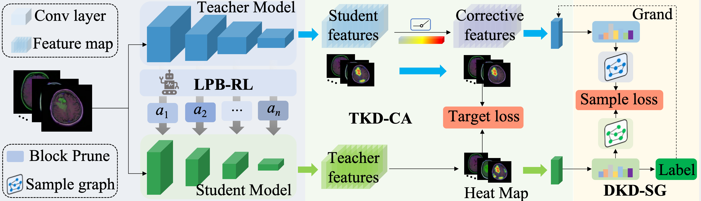

# Reinforcement Compression and Sample Knowledge Distillation Method for Brain MRI Diagnosis

## Overview

<div style="text-align:center">
</div>
Deep learning models for brain Magnetic Resonance Imaging (MRI) analysis are increasingly used to support clinical measurement and monitoring. However, their highly complex architectures with millions of parameters create challenges in balancing diagnostic accuracy and computational efficiency. We propose a novel Reinforcement Compression and Sample Knowledge Distillation (RC-SKD) framework to address this limitation. Firstly, Lightweight Pruning for Block-wise with Reinforcement Learning (LPB-RL) is designed, which adaptively determines optimal pruning ratios to construct efficient student networks. Secondly, Targeted Knowledge Distillation based on Corrective Attention (TKD-CA) is introduced, which quantifies the contribution of intermediate-layer features from the teacher model to the target label, thereby suppressing redundant representations. Finally, Differential Knowledge Distillation by Samples Graphical Representation (DKD-SG) is proposed, which captures heterogeneous structural and textural characteristics of brain MRI data through graph-based representation learning. Experimental evaluations on brain MRI datasets and the CIFAR-100 demonstrate that RC-SKD achieves an average 50% parameter reduction with only a 7% decrease in accuracy. Moreover, RC-SKD consistently outperforms the best baseline knowledge distillation approach by an average margin of 2.1% in accuracy, confirming the effectiveness of its multi-stage design. RC-SKD compresses diagnostic networks while preserving measurement reliability. This framework enables more efficient deployment of deep learning-driven MRI measurement systems in clinical environments. The code and pre-trained model are available at https://github.com/CV-Med/RC-SKD.git.

# Construction

    git clone https://github.com/CV-Med/RC-SKD.git


## Training with BTNet-TS

Copy or download your images into data folder, and:

    python train.py

## Testing with RC-SKD

    python test.py


Check the configurations of the training in train.py


## Brain Tumor Dataset dataset (Brain-3)

Here the [link](https://www.scidb.cn/en/detail?dataSetId=faa44e0a12da4c11aeee91cc3c8ac11e#detail_start)

## Citation

```
Jun Cheng. Brain Tumor Dataset[DS/OL]. V1. Science Data Bank, 2022[2024-08-24]. 
https://cstr.cn/31253.11.sciencedb.06290. CSTR:31253.11.sciencedb.06290.
```

## Brain Tumor MRI Dataset (Brain-4)

Here the [link](https://www.kaggle.com/datasets/masoudnickparvar/brain-tumor-mri-dataset)

## Citation

```
“Brain Tumor MRI Dataset.” Accessed: Aug. 24, 2024. [Online]. 
Available: https://www.kaggle.com/datasets/masoudnickparvar/brain-tumor-mri-dataset
```
## Brain-CT

Here the [link](https://dx.doi.org/10.21227/n9jf-tp19)
