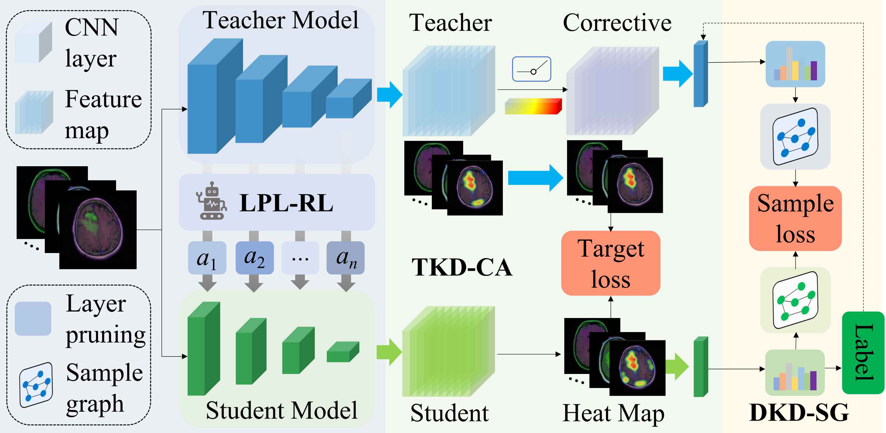

<p align="center">
  
</p>

<h1 align="center">RC-SKD: Reinforcement Compression and Sample Knowledge Distillation for Brain Image Diagnosis</h1>

<p align="center">
  <a href="https://www.python.org/downloads/release/python-390/"></a>
  <a href="https://pytorch.org/"></a>
</p>

<p align="center">
  <b>State-of-the-art model compression + knowledge distillation for medical image diagnosis.</b><br>
  Achieves <b>51.4% avg parameter reduction</b> with only <b>6.8% accuracy drop</b>,<br>
  and <b>6.4% avg student accuracy improvement</b> across brain MRI/CT and CIFAR-100 benchmarks.
</p>

---
## Overview

Deep learning models for brain image analysis are increasingly used to support clinical measurement and monitoring. However, their highly complex architectures with millions of parameters create challenges in balancing diagnostic accuracy and computational efficiency. We propose a novel **Reinforcement Compression and Sample Knowledge Distillation (RC-SKD)** framework with three complementary modules:

| Module | Full Name | Role |
|--------|-----------|------|
| **LPL-RL** | Lightweight Pruning for Layer-wise with Reinforcement Learning | RL-guided pruning — learns optimal per-block pruning ratios | 
| **TKD-CA** | Targeted Knowledge Distillation based on Corrective Attention | Suppresses redundant features via gradient-weighted attention | 
| **DKD-CG** | Differential Knowledge Distillation by Continuous Samples Graphical | Aligns teacher-student topological graphs via continuous memory bank |

Experimental evaluations demonstrate:
- **51.4%** average parameter reduction across all architectures
- Only **6.8%** decrease in top-1 accuracy after aggressive pruning
- **+6.4%** average student accuracy improvement after knowledge distillation
- Consistent gains on **Brain-4**, **Brain-3**, **Brain-CT**, and **CIFAR-100**

---


## Installation

```bash
# Clone the repository
git clone https://github.com/CV-Med/RC-SKD.git
cd RC-SKD

# Install dependencies
pip install -r requirements.txt
```

**Requirements:** Python 3.9+, PyTorch 2.0+, CUDA-capable GPU (recommended)

Key dependencies:
| Package | Version | Purpose |
|---------|---------|---------|
| `torch` | ≥ 2.0.0 | Deep learning framework |
| `torchvision` | ≥ 0.15.0 | Model zoo & image transforms |
| `gymnasium` | ≥ 0.29.0 | RL environment API |
| `stable_baselines3` | ≥ 2.0.0 | DDPG reinforcement learning agent |
| `numpy` | ≥ 1.24.0 | Numerical operations |
| `tqdm` | ≥ 4.66.0 | Training progress bars |
| `scikit-learn` | ≥ 1.2.0 | AUC metrics & cross-validation |
| `matplotlib` | ≥ 3.6.0 | Grad-CAM visualization |
| `Pillow` | ≥ 9.4.0 | Image I/O |

---

## Quick Start

Run a minimal RC-SKD pipeline on CIFAR-100 with ResNet-18 in under 60 seconds (dataset auto-downloads):

```bash
# 1. Install dependencies
pip install -r requirements.txt

# 2. Fine-tune teacher on CIFAR-100
python run_pipeline.py --dataset CIFAR100 --teacher resnet18 --stage pretrain --pretrain_epochs 10

# 3. Run LPL-RL pruning
python run_pipeline.py --dataset CIFAR100 --teacher resnet18 --stage prune --prune_epochs 10

# 4. Distill with TKD-CA + DKD-CG
python run_pipeline.py --dataset CIFAR100 --teacher resnet18 --stage all --distill_epochs 10

# 5. Evaluate
python test.py --dataset CIFAR100 --model_path ./weights/dkd_cg_best_model.pth
```

---

## Dataset Preparation

### Supported Datasets

| Dataset | Classes | Samples | Description | Source |
|---------|---------|---------|-------------|--------|
| **Brain-4** | 4 (glioma, meningioma, no tumor, pituitary) | 7,023 | Brain tumor MRI | [Kaggle](https://www.kaggle.com/datasets/masoudnickparvar/brain-tumor-mri-dataset) |
| **Brain-3** | 3 | 3,064 | Brain tumor MRI | [Science Data Bank](https://www.scidb.cn/en/detail?dataSetId=faa44e0a12da4c11aeee91cc3c8ac11e) |
| **Brain-CT** | 4 (hemorrhage, ischemia, tumor, healthy) | 4,200 | Brain CT | [IEEE Dataport](https://dx.doi.org/10.21227/n9jf-tp19) |
| **CIFAR-100** | 100 | 50,000 | Natural images | Auto-downloaded by torchvision |

### Data Structure

```
data/
├── Brain_4/
│   ├── train/
│   │   ├── glioma/
│   │   ├── meningioma/
│   │   ├── notumor/
│   │   └── pituitary/
│   └── val/
├── Brain_3/
│   ├── train/
│   └── val/
└── Brain_CT/
    ├── train/
    └── val/
```

Place your downloaded datasets into `data/` following the structure above. CIFAR-100 is automatically downloaded when used.

---

## Usage

### Full Pipeline (End-to-End)

Run the complete RC-SKD pipeline (pruning → TKD-CA → DKD-CG) with a single command:

```bash
python run_pipeline.py --dataset Brain_4 --teacher resnet34 --stage all
```

**Arguments:**

| Argument | Default | Choices | Description |
|----------|---------|---------|-------------|
| `--dataset` | `Brain_4` | `Brain_4`, `Brain_3`, `Brain_CT`, `CIFAR100` | Dataset to use |
| `--teacher` | `resnet34` | `resnet18`, `resnet34`, `resnet50`, `resnet101`, `densenet121`, `densenet169`, `densenet201` | Teacher architecture |
| `--stage` | `all` | `pretrain`, `prune`, `tkd`, `dkd`, `all` | Pipeline stage to run |
| `--prune_epochs` | `50` | — | Fine-tuning epochs during pruning |
| `--pretrain_epochs` | `50` | — | Teacher fine-tuning epochs (Stage 0) |
| `--distill_epochs` | `200` | — | Distillation training epochs |
| `--teacher_pth` | `None` | — | Path to pretrained teacher (auto fine-tuned if not provided) |
| `--student_pth` | `None` | — | Path to initial student (auto-generated from prune stage) |

### Step-by-Step Execution

#### Stage 1: LPL-RL Pruning

```bash
python run_pipeline.py --dataset Brain_4 --teacher resnet34 --stage prune
```

This runs the DDPG agent to learn optimal pruning ratios. The pruned student model is saved to `./weights/pruned_Brain_4_resnet34.pth`.

Or run LPL-RL standalone:

```bash
python models/lpl_rl.py
```

#### Stage 2: TKD-CA Distillation

```bash
python run_pipeline.py --dataset Brain_4 --teacher resnet34 --stage tkd \
  --student_pth ./weights/pruned_Brain_4_resnet34.pth
```

Or run TKD-CA standalone:

```bash
python models/tkd_ca.py
```

#### Stage 3: DKD-CG Distillation

```bash
python run_pipeline.py --dataset Brain_4 --teacher resnet34 --stage dkd \
  --student_pth ./weights/pruned_Brain_4_resnet34.pth
```

Or run DKD-CG standalone:

```bash
python models/dkd_cg.py
```

#### KL Baseline

For comparison with standard knowledge distillation:

```bash
python models/kl.py
```

### Evaluation

```bash
python test.py --dataset Brain_4 --model_path ./weights/tkd_ca_0.695_model.pth
```

With teacher comparison:

```bash
python test.py --dataset Brain_4 \
  --model_path ./weights/dkd_cg_0.712_model.pth \
  --teacher_path ./weights/teacher_Brain_4_resnet34.pth
```

### Cross-Validation

```bash
python -c "
from utils.cross_val import cross_validate
from utils.trainer import train_eval as train_fn
import torch, torchvision.models as models

def model_init():
    m = models.resnet34(weights='DEFAULT')
    m.fc = torch.nn.Linear(m.fc.in_features, 4)
    return m

accs = cross_validate(train_fn, model_init, 'Brain_4', n_splits=5)
"
```

### Grad-CAM Visualization

```bash
# ResNet teacher
python -c "
import torch
from utils.gradcam import visualize_gradcam
model = torch.load('./weights/teacher_Brain_4_resnet34.pth', weights_only=False)
target_layer = model.layer4[-1] if hasattr(model, 'layer4') else model.features[-1]
visualize_gradcam(model, 'data/Brain_4/val/glioma/image.jpg', target_layer)
"
```

```bash
# DenseNet teacher
python -c "
import torch
from utils.gradcam import visualize_gradcam
model = torch.load('./weights/teacher_Brain_4_densenet121.pth', weights_only=False)
target_layer = model.features.denseblock4.denselayer16.conv2
visualize_gradcam(model, 'data/Brain_4/val/glioma/image.jpg', target_layer)
"
```

---

## Results

**Summary:** RC-SKD achieves an average **51.4% parameter reduction** with only a **6.8% decrease in accuracy**, and improves student accuracy by an average of **6.4%** across all datasets. Detailed results on the Brain-4, Brain-3, Brain-CT, and CIFAR-100 datasets are presented below.

### Table 1: Knowledge Distillation Accuracy (%) — RC-SKD vs SOTA on Brain-4

| Teacher Arch | Teacher | Pruned Student | KD | VID | DKD | KED | NRKD | RDKD | **RC-SKD** |
|-------------|---------|---------------|-----|-----|-----|-----|------|------|-----------|
| ResNet-18 | 71.9 | 70.3 | 70.5±0.20 | 70.9±0.21 | 70.9±0.23 | 71.1±0.19 | 71.1±0.22 | 71.2±0.21 | **71.8±0.16** |
| ResNet-34 | 72.2 | 71.4 | 71.5±0.21 | 71.7±0.20 | 71.7±0.22 | 71.8±0.20 | 71.8±0.21 | 71.8±0.19 | **72.2±0.15** |
| ResNet-50 | 72.8 | 71.9 | 72.1±0.20 | 72.3±0.19 | 72.3±0.19 | 72.4±0.17 | 72.5±0.18 | 72.6±0.19 | **72.7±0.16** |
| ResNet-101 | 73.9 | 71.2 | 71.8±0.18 | 72.4±0.17 | 72.3±0.18 | 72.6±0.19 | 72.7±0.17 | 72.8±0.18 | **73.0±0.16** |
| DenseNet-121 | 73.3 | 72.7 | 72.7±0.16 | 72.9±0.15 | 72.9±0.17 | 72.9±0.18 | 73.0±0.16 | 73.0±0.15 | **73.1±0.15** |
| DenseNet-169 | 73.6 | 72.1 | 72.3±0.16 | 72.7±0.16 | 72.6±0.15 | 72.8±0.16 | 72.9±0.14 | 72.9±0.13 | **73.6±0.14** |
| DenseNet-201 | 74.0 | 72.8 | 73.1±0.15 | 73.4±0.17 | 73.3±0.15 | 73.5±0.14 | 73.5±0.16 | 73.5±0.15 | **73.8±0.13** |

Results reported as mean ± 95% CI over 5 patient-wise folds. Teacher = pre-trained + fine-tuned.  
All methods share the same pre-trained teacher. **Bold** = best result.

### Table 2: Cross-Dataset Generalization — RC-SKD vs SOTA (ResNet-34 / ResNet-50)

| Dataset | Backbone | Teacher | Pruned | KD | VID | DKD | **RC-SKD** | Δ vs SAcc |
|---------|----------|---------|--------|-----|-----|-----|-----------|-----------|
| Brain-4 | ResNet-34 | 72.2 | 71.4 | 71.5±0.21 | 71.7±0.20 | 71.7±0.22 | **72.2±0.15** | +0.8 |
| Brain-3 | ResNet-50 | 70.2 | 63.2 | 64.9±0.58 | 66.5±0.56 | 66.2±0.57 | **68.2±0.53** | +5.0 |
| Brain-CT | ResNet-34 | 72.4 | 65.7 | 66.8±0.60 | 68.1±0.58 | 67.9±0.59 | **71.2±0.52** | +5.5 |
| Brain-CT | ResNet-101 | 73.5 | 67.4 | 68.4±0.56 | 69.6±0.54 | 69.3±0.55 | **72.3±0.52** | +4.9 |
| CIFAR-100 | ResNet-50 | 80.5 | 74.1 | 75.5±0.32 | 77.0±0.30 | 76.7±0.31 | **79.3±0.29** | +5.2 |

Δ vs SAcc = RC-SKD accuracy improvement over the pruned student baseline.

### Table 3: Parameter Reduction by Architecture

| Architecture | Original Params | Pruned Params | Reduction |
|-------------|----------------|---------------|-----------|
| ResNet-18 | 11.17 M | 5.72 M | 48.8% |
| ResNet-34 | 21.28 M | 10.92 M | 48.7% |
| ResNet-50 | 23.52 M | 11.68 M | 50.3% |
| ResNet-101 | 42.51 M | 20.43 M | 51.9% |
| DenseNet-121 | 7.04 M | 3.46 M | 50.8% |
| DenseNet-169 | 12.49 M | 6.12 M | 51.0% |
| DenseNet-201 | 18.10 M | 8.67 M | 52.1% |
| **Average** | — | — | **51.4%** |

---

## Hyperparameters

Experimental environment and hyperparameter settings from the paper (Table 1):

| System Component | Specification |
|-----------------|---------------|
| CPU | Intel Xeon Platinum 8255C (12 vCPU) |
| GPU | NVIDIA RTX 4090 × 1 |
| OS | Ubuntu 20.04 LTS |
| CUDA | 12.1 |
| Framework | PyTorch 2.4.1 |
| Optimizer | Adam |

| Training Parameter | Pruning (LPL-RL, fine-tune) | Distillation (TKD-CA/DKD-CG) |
|--------------------|----------------------------|------------------------------|
| Learning rate | 1×10⁻² | 1×10⁻³ |
| Batch size (brain datasets) | 16 | 16 |
| Batch size (CIFAR-100) | 32 | 32 |
| Epochs | 50 | 200 |
| Input size | 224×224 | 224×224 |
| $T$ (temperature) | — | 3.0 |
| $\lambda$ (reward) | 1000 | — |
| $\alpha$ (TKD-CA) | — | 3.0 |
| $\beta$ (DKD-CG) | — | 5.0 |
| Pruning ratio range | [0.3, 0.5] | — |
| DDPG action noise | $\sigma = 0.1$ | — |
| DDPG timesteps | 1000 | — |

### Evaluation Metrics (Eq.17-19)

Three metrics are used for evaluation (results reported as mean ± 95% CI over 5 patient-wise folds):

- **Accuracy** (Eq.17): $Acc = \frac{TP + TN}{TP + FP + TN + FN} \times 100\%$
- **FLOPs Reduction** (Eq.18): $Fr = \big(1 - \frac{FLOPs(M_S)}{FLOPs(M_T)}\big) \times 100\%$
- **AUC** (Eq.19): $AUC = \frac{1}{C}\sum_{c=1}^{C} \int_0^1 TP_c(x) d(FP_c(x))$

---

## Ablation Guide

The framework supports ablation experiments to isolate each component's contribution:

### Disable TKD-CA (run DKD-CG only)

```bash
python run_pipeline.py --dataset Brain_4 --teacher resnet34 --stage dkd
```

### Disable DKD-CG (run TKD-CA only)

```bash
python run_pipeline.py --dataset Brain_4 --teacher resnet34 --stage tkd
```

### KL baseline (no corrective attention, no graph)

```bash
python models/kl.py
```

### Compare all methods

```bash
# 1. Prune
python run_pipeline.py --dataset Brain_4 --teacher resnet34 --stage prune

# 2. KL baseline
python models/kl.py

# 3. TKD-CA
python run_pipeline.py --dataset Brain_4 --teacher resnet34 --stage tkd

# 4. DKD-CG
python run_pipeline.py --dataset Brain_4 --teacher resnet34 --stage dkd

# 5. Evaluate all
python test.py --dataset Brain_4 --model_path ./weights/kl_best_model.pth
python test.py --dataset Brain_4 --model_path ./weights/tkd_ca_best_model.pth
python test.py --dataset Brain_4 --model_path ./weights/dkd_cg_best_model.pth
```

---

## Project Structure

```
RC-SKD/
├── run_pipeline.py          # Pipeline orchestrator (pretrain → prune → TKD → DKD)
├── test.py                  # Evaluation: accuracy + AUC + FPR + FNR + FLOPs reduction
├── setup.py                 # Package setup for pip install -e .
├── requirements.txt         # Python dependencies
├── .gitignore               # Git ignore rules
├── LICENSE                  # MIT license
├── models/
│   ├── lpl_rl.py            # Stage 1: RL-based pruning environment + DDPG agent
│   ├── cut_res.py           # ResNet pruning: per-block channel pruning + fine-tuning
│   ├── cut_dens.py          # DenseNet pruning: per-denseblock channel pruning + fine-tuning
│   ├── tkd_ca.py            # Stage 2: Corrective attention knowledge distillation
│   ├── dkd_cg.py            # Stage 3: Graph-based knowledge distillation
│   ├── kl.py                # Baseline: standard KL-divergence knowledge distillation
│   ├── graph_distillation.py# DKD-CG support: ContinuousMemoryBank, graph builder, Loss_compute
│   └── corrective_attention.py # TKD-CA support: gradient-weighted attention, loss functions
├── utils/
│   ├── trainer.py           # General fine-tuning (teacher pre-training)
│   ├── metrics.py           # compute_metrics (Eq.17,19), compute_flops_reduction (Eq.18)
│   ├── cross_val.py         # K-fold stratified cross-validation with 95% CI
│   └── gradcam.py           # Grad-CAM heatmap generation (Fig.12)
├── data/
│   ├── Brain_4/             # Brain tumor MRI (4 classes)
│   ├── Brain_3/             # Brain tumor MRI (3 classes)
│   ├── Brain_CT/            # Brain CT (4 conditions)
│   └── fig1.png             # Architecture diagram
└── weights/                 # Saved model checkpoints (auto-created)
```

### File Descriptions

| File | Responsibility | Key Functions |
|------|---------------|--------------|
| `models/lpl_rl.py` | RL pruning environment | `PruningEnv` — Gymnasium env with $R = \lambda \cdot Acc \cdot \text{mean}(a_k)$ |
| `models/cut_res.py` | ResNet pruning | `target_model()` — prune + fine-tune ResNet18/34/50/101 |
| `models/cut_dens.py` | DenseNet pruning | `target_model()` — prune + fine-tune DenseNet121/169/201 |
| `models/graph_distillation.py` | DKD-CG loss | `ContinuousMemoryBank`, `Loss_compute` — graph-based distillation |
| `models/corrective_attention.py` | TKD-CA loss | `Loss_compute` — corrective attention via $L_{CE} + L_{soft}$ |
| `models/tkd_ca.py` | TKD-CA training loop | `train()` — corrective attention distillation trainer |
| `models/dkd_cg.py` | DKD-CG training loop | `train()` — graph knowledge distillation trainer |
| `models/kl.py` | KL baseline | `train()` — standard KL-divergence distillation |
| `run_pipeline.py` | Pipeline orchestration | CLI with `--dataset`, `--teacher`, `--stage` arguments |
| `utils/trainer.py` | Teacher pre-training | `train_eval()` — generic fine-tuning loop |
| `utils/metrics.py` | Evaluation metrics | `compute_metrics()` (Eq.17,19), `compute_flops_reduction()` (Eq.18) |
| `utils/cross_val.py` | Cross-validation | `get_kfold_loaders()`, `cross_validate()`, `mean_confidence_interval()` |
| `utils/gradcam.py` | Explainability | `GradCAM` class, `visualize_gradcam()` — overlay heatmaps |
| `test.py` | Model evaluation | accuracy + AUC + FPR/FNR + FLOPs reduction in one script |

---

## Citation

If you use this code or find our work useful, please cite:

```bibtex
@article{zhou2025rcskd,
  title={Reinforcement Compression and Sample Knowledge Distillation Method for Brain Image Diagnosis},
  author={Zhou, Bo and Xiao, Li and Fan, Cheng},
  year={2025}
}
```

---
